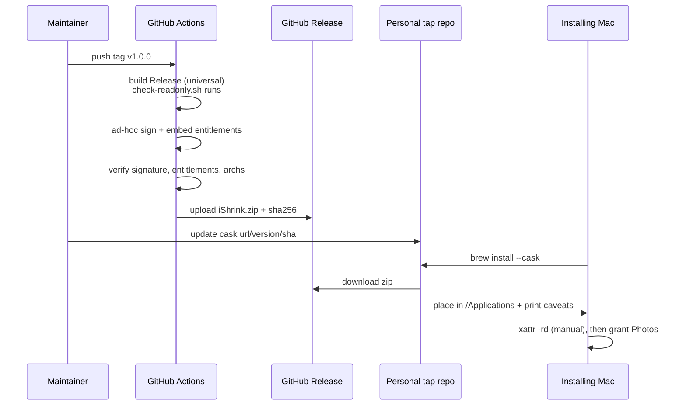

# feat: Homebrew-installable iShrink — CI-built app, personal tap, no Xcode

## Summary

Move the iShrink app build off the developer's Mac and onto GitHub Actions, so that tagging a release produces a downloadable `.app` that installs with a single `brew install` from a personal Homebrew tap. Ships unsigned (ad-hoc signature only) with the Gatekeeper friction documented rather than hidden; Developer ID signing and notarization are designed for as a drop-in later stage but are not built here.

---

## Problem Frame

Phase 1 is merged and passing 112 tests, but iShrink is not usable as an app — it only exists as an Xcode build. The maintainer finds the Xcode build/run/test setup difficult enough that it blocks actually using the tool on a real photo library, which is the outstanding validation gap for Phase 1. The PRD already commits to "notarized direct download (and Homebrew)" as the v1 distribution channel (origin: `iShrink-PRD.md` § Distribution); this plan delivers the Homebrew half of that on the free tier, ahead of the paid-signing half.

---

## Requirements

- R1. iShrink installs with a single `brew install` command from a personal tap, with no Xcode, no toolchain setup, and no source build on the installing machine.
- R2. The `.app` artifact is built and published automatically by CI from a version tag — the maintainer never runs `xcodebuild` to produce a release.
- R3. The published app must launch on Apple Silicon, which requires at minimum an ad-hoc code signature; a genuinely unsigned arm64 binary will not execute.
- R4. App Sandbox and the Photos-library entitlement must survive the CI build, export, and re-sign, and the installed app must be able to obtain Photos access.
- R5. The Gatekeeper quarantine step and the Photos-permission-resets-per-update behaviour must be surfaced explicitly to the installing user, not left to be discovered.
- R6. Release version numbers derive from the git tag rather than the hardcoded `MARKETING_VERSION: "1.0.0"` in `project.yml`.
- R7. A local one-command build-and-install path exists that does not depend on GitHub Actions or Homebrew, usable immediately and as a permanent fallback.
- R8. Adding Developer ID signing and notarization later must be a configuration change to the existing pipeline, not a rewrite of it.
- R9. The `iShrink` repository and the new tap repository are public before the release pipeline is exercised, so release assets are fetchable by an unauthenticated `brew install` (R1) and CI does not incur private-repo runner billing.

---

## Scope Boundaries

- **No Developer ID signing or notarization.** Deliberately deferred (see Deferred to Follow-Up Work). The pipeline is shaped so this drops in, but no certificate, no App Store Connect API key, and no `notarytool` step is built now.
- **No Mac App Store submission.** The PRD keeps this as a possible later path; nothing here advances or blocks it.
- **No auto-update mechanism** (Sparkle or equivalent). Updates are `brew upgrade`.
- **No CLI over `iShrinkCore`.** Remains an independent PRD stretch goal, unaffected by this work.
- **No submission to the official `homebrew/cask` catalog.** That catalog stops hosting Gatekeeper-failing casks on 2026-09-01 and would reject an unsigned app; a personal tap is the only viable channel on the free tier.
- **No changes to compression behaviour, the UI, or `iShrinkCore`.** This plan touches build, packaging, and documentation only. The read-only Photos invariant and its `scripts/check-readonly.sh` enforcement are unchanged and must continue to run.
- **No attempt to suppress the Gatekeeper warning programmatically.** Homebrew removed `--no-quarantine` in 5.1 and it is unavailable to personal taps; the plan documents the manual step rather than working around it. This applies to the Homebrew-distributed artifact specifically — a locally built app (U1) was never quarantined to begin with, since quarantine is an attribute macOS attaches only to files downloaded from the internet, so clearing it in the local build script is a defensive no-op, not programmatic suppression.

### Deferred to Follow-Up Work

- **Stage 2: Developer ID signing + notarization + stapling** — a later change adding certificate/API-key secrets and a `notarytool` step to the same workflow, plus removal of the cask's quarantine caveat.
- **Automated cask version/sha bumping** — the release workflow opening a PR against the tap repo. Manual sha update is acceptable at current release frequency.
- **Intel-specific validation** — a universal binary is produced, but testing on Intel hardware is out of scope.

---

## Context & Research

### Relevant Code and Patterns

- `project.yml` — XcodeGen manifest. Already sets `ENABLE_HARDENED_RUNTIME: YES`, `CODE_SIGN_ENTITLEMENTS: App/iShrink.entitlements`, `CODE_SIGN_STYLE: Automatic`, and carries an explicit comment at line 42 that no Developer Team is configured. `MARKETING_VERSION` is hardcoded to `1.0.0`.
- `App/iShrink.entitlements` — App Sandbox on, `com.apple.security.personal-information.photos-library` on, deliberately no network entitlement. These must be present in the shipped binary or the app cannot read Photos.
- `scripts/check-readonly.sh` — wired as a `prebuildScripts` entry on the `iShrink` target. It will run inside CI builds automatically; this is desirable and must not be bypassed.
- `iShrink.xcodeproj` is committed to the repo (only `xcuserdata` is gitignored), so CI can build without running XcodeGen.
- No `.github/` directory exists. There is no existing CI, release, or packaging pattern in this repo to follow — all of it is new.
- `Kalantri007/iShrink` is currently a **private** repository (confirmed via `gh repo view`). This must change before U3/U4 are exercised — see R9.

### External References

- Homebrew removed `--no-quarantine` support in 5.1 (~March 2026); maintainers confirmed personal taps are affected and that `sudo xattr -rd com.apple.quarantine /path/to/App.app` is the expected post-install step. Official-catalog support for Gatekeeper-failing casks ends 2026-09-01.
- Apple Silicon will not execute unsigned arm64 code, but does execute ad-hoc signed code (`codesign -s -`). Ad-hoc signing is therefore mandatory, not optional.
- An ad-hoc signature identifies exactly one build instance; TCC (the privacy permission system) keys grants to that identity, so Photos permission is expected to reset on each new build. Mixing ad-hoc and Developer ID signatures under the same bundle ID is documented to leave TCC treating permissions as ungranted.

---

## Key Technical Decisions

- **Ad-hoc sign rather than build unsigned:** required for the app to launch at all on Apple Silicon (R3). `CODE_SIGNING_ALLOWED=NO` is not a viable export mode for this project.
- **Build Release directly with an ad-hoc identity rather than `archive` + `exportArchive`:** the export-options-plist path exists to produce distribution-signed artifacts, which is not what this stage produces. Exact invocation shape is deferred to implementation.
- **`CODE_SIGN_STYLE: Automatic` must be overridden at build time, not changed in `project.yml`:** automatic signing requires an Apple account signed into the machine, which a CI runner does not have, so it will fail there. Overriding the signing style and identity per-invocation keeps the manifest usable for local Xcode development while letting both the local script and CI produce ad-hoc-signed builds.
- **Do not run XcodeGen in CI:** `iShrink.xcodeproj` is committed, so CI builds it directly and passes the version as an `xcodebuild` setting override. This keeps `project.yml`'s hand-authored Info.plist/entitlements handling (documented at `project.yml:25-32`) out of the CI path entirely.
- **Universal binary (arm64 + x86_64):** built once, works on both architectures, negligible added cost, avoids a second distribution channel.
- **Personal tap, not official catalog:** the only channel that accepts an unsigned app, both now and after 2026-09-01.
- **Prove the risky chain locally before automating it:** U1 exists specifically so that the ad-hoc-signature → sandbox → Photos-access question is answered on real hardware before any CI is written. If that chain fails, the CI work would have been wasted.
- **Quarantine friction is documented, not hidden:** surfaced in cask `caveats` and the README, because no supported mechanism to remove it remains.
- **Both `iShrink` and the new tap repository must be public before the release pipeline runs (R9):** a private repo's release assets require an authenticated download, which breaks an unauthenticated `brew install` and would defeat R1's "no toolchain setup" promise. Making the repos public also removes the private-repo GitHub Actions macOS-runner billing multiplier, and aligns with the PRD's own "fully open source" goal.

---

## Open Questions

### Resolved During Planning

- Signing posture: free/ad-hoc now, Developer ID deferred — maintainer decision, made with the friction costs stated.
- Quarantine handling: manual `xattr` command surfaced via cask caveats — forced by Homebrew 5.1's removal of `--no-quarantine`.
- Distribution channel: personal Homebrew tap — official catalog will not accept an unsigned app.
- Repo visibility: `iShrink` and the new tap repo are made public before the release pipeline is exercised (R9) — required for unauthenticated cask downloads to work at all, and removes the private-repo CI cost question as a side effect.
- Release trigger: git tag push, not every commit to `main` — releases should be deliberate.
- Whether to keep the SwiftUI app or pivot to a CLI: keep the app; the CLI stays a separate stretch goal.

### Deferred to Implementation

- Exact `xcodebuild` invocation and whether a separate `codesign` re-sign pass is needed after the build, or whether setting the identity during build is sufficient — depends on how the prebuild script and entitlements interact in practice.
- Which macOS runner image and Xcode version to pin — should be chosen against what the runner actually offers at implementation time, then pinned rather than floating.
- Whether the Photos permission survives a `brew upgrade` in practice or resets every time — expected to reset, but the exact behaviour should be observed and then documented accurately in U5 rather than guessed.
- `ditto` vs `zip` for producing the release archive — whichever reliably preserves the bundle's symlinks and signature.
- Whether `ENABLE_HARDENED_RUNTIME: YES` (already set in `project.yml:40`) behaves correctly alongside an ad-hoc signature and the App Sandbox. Hardened runtime exists to satisfy notarization, which this stage does not perform. It should be satisfied by any valid signature including ad-hoc, but this is untested here — if it interferes with launch or Photos access, disabling it for ad-hoc builds only (and restoring it for the deferred signed stage) is the expected remedy. U1 is where this surfaces.

---

## High-Level Technical Design

> *This illustrates the intended approach and is directional guidance for review, not implementation specification. The implementing agent should treat it as context, not code to reproduce.*

The local path (U1) is the same middle section run on the maintainer's own machine, skipping GitHub entirely — which is why it doubles as both the immediate escape hatch and the permanent fallback if Homebrew tightens further.

---

## Implementation Units

- U1. **Local build-and-install script + artifact verifier**

**Goal:** One command turns the repo into a working `/Applications/iShrink.app` on the maintainer's machine, and a companion script asserts the produced bundle is actually valid. This unit is the de-risking gate for the whole plan.

**Requirements:** R3, R4, R7

**Dependencies:** None

**Files:**
- Create: `scripts/build-app.sh`
- Create: `scripts/verify-app.sh`

**Approach:**
- `build-app.sh` builds the `iShrink` scheme in Release for both architectures, applies an ad-hoc signature with the existing entitlements file, clears the quarantine attribute on the local result, and installs to `/Applications`.
- `verify-app.sh` takes a path to a built `.app` and asserts the properties that silently break distribution: signature validity, presence of both sandbox and Photos entitlements in the *signed* binary, and both architectures present. Split from the build script so CI can reuse it against the CI-produced artifact without rebuilding.
- Scripts must fail loudly on any missing precondition rather than producing a half-built bundle.

**Execution note:** This unit is a gate. Before proceeding to U3, launch the installed app and confirm Photos access is actually obtainable. If an ad-hoc-signed sandboxed build cannot get Photos access at all, stop and report — the free route is not viable and the plan needs revisiting, not more CI. Expect the Photos permission prompt to reappear on every local rebuild during normal iteration, not just on tagged releases — each build gets a fresh ad-hoc signing identity, and TCC treats it as a new app each time. This is expected friction from the signing approach, not a defect in the script.

**Patterns to follow:**
- `scripts/check-readonly.sh` — existing script conventions in this repo (shell, fails the build loudly, self-describing output).
- `App/iShrink.entitlements` is the entitlements source of truth; do not duplicate its contents into a script.

**Test scenarios:**
- Happy path: running the build script on a clean checkout produces `/Applications/iShrink.app`, and the verifier passes on it.
- Happy path: the installed app launches, prompts for Photos access, and reaches the scan screen after access is granted — the gate condition.
- Error path: verifier run against a bundle with no signature exits non-zero naming the missing signature.
- Error path: verifier run against a bundle whose signed binary lacks `com.apple.security.personal-information.photos-library` exits non-zero naming the missing entitlement. This is the failure that would otherwise ship a silently Photos-blind app.
- Edge case: verifier run against a single-architecture build exits non-zero naming the missing architecture.
- Integration: `scripts/check-readonly.sh` still executes as part of this build and still fails the build when a PhotoKit mutation API is introduced into `iShrinkCore`.

**Verification:** A maintainer with no Xcode GUI interaction can go from clean checkout to a running, Photos-authorized iShrink using one command.

---

- U2. **Version derived from git tag**

**Goal:** Release builds carry the tag's version instead of the hardcoded `1.0.0`, so Homebrew can tell versions apart.

**Requirements:** R6

**Dependencies:** U1 (the build script is where the override is threaded through)

**Files:**
- Modify: `project.yml`
- Modify: `scripts/build-app.sh`

**Approach:**
- Derive the version from the current tag when building from one, falling back to a clear development placeholder when building from an untagged working copy.
- Pass it to `xcodebuild` as a setting override rather than rewriting `project.yml` at build time — this keeps the committed `.xcodeproj` and the hand-authored plists untouched, per the constraint documented at `project.yml:25-32`.
- Leave the value in `project.yml` as the local-development default so opening the project in Xcode still works.

**Test scenarios:**
- Happy path: building from a tagged commit produces a bundle whose reported short version matches the tag.
- Edge case: building from an untagged working copy produces a recognizable development version rather than failing or silently reporting `1.0.0`.

**Verification:** Two builds from two different tags produce bundles that report different versions.

---

- U3. **GitHub Actions release workflow**

**Goal:** Pushing a version tag produces a published GitHub Release containing a verified, ad-hoc-signed, universal `iShrink.zip` — with no local build step.

**Requirements:** R2, R3, R4, R8

**Dependencies:** U1, U2

**Files:**
- Create: `.github/workflows/release.yml`

**Approach:**
- Trigger on version tag pushes only.
- Run on a pinned macOS runner image with a pinned Xcode version — floating versions are how this class of workflow silently rots.
- Reuse `scripts/build-app.sh` and `scripts/verify-app.sh` rather than duplicating build logic in YAML; the workflow's job is orchestration, not build definition. This is also what keeps the local and CI paths from diverging.
- Archive the bundle in a way that preserves symlinks and the signature, publish it as a release asset, and emit the SHA-256 into the release notes so the cask update is a copy-paste.
- The workflow must fail the release if `verify-app.sh` fails — a broken artifact must never reach a release page.

**Test scenarios:**
- Happy path: pushing a version tag results in a release containing the zip asset and its published checksum.
- Happy path: the artifact downloaded from the release passes `verify-app.sh` on a local machine — proving CI and local builds produce equivalent bundles.
- Error path: a build whose signed binary is missing entitlements fails the workflow and publishes no release asset.
- Integration: `scripts/check-readonly.sh` runs inside the CI build and fails the workflow if the read-only Photos invariant is violated.
- Edge case: pushing a non-tag commit to `main` does not trigger a release.

**Verification:** A release exists on GitHub whose asset, downloaded and unzipped by hand, launches and reaches the Photos permission prompt.

---

- U4. **Homebrew tap and cask**

**Goal:** `brew install --cask` fetches the CI-built release and places iShrink in `/Applications`, telling the user exactly what to do next.

**Requirements:** R1, R5

**Dependencies:** U3 (needs a real release asset and its checksum)

**Files:**
- Create (in a **separate new repository**, `homebrew-tap`, not this repo): `Casks/ishrink.rb`

**Approach:**
- Homebrew tap repositories must be named `homebrew-<tapname>`; the cask lives under `Casks/`.
- The cask points at the release asset URL with the version interpolated, so future version bumps are a two-line change.
- Install is a single fully-qualified command — `brew install --cask <user>/tap/ishrink` — which auto-taps and installs in one invocation, matching R1's "single `brew install` command" promise exactly rather than requiring a separate `brew tap` step first.
- `caveats` carries the two things the user must know and cannot discover on their own: the exact quarantine-clearing command for this specific app path, and the fact that Photos permission must be re-granted after each update because the build identity changes.
- Include an uninstall/zap definition so `brew uninstall` genuinely removes the app.
- Do **not** attempt `--no-quarantine` or any equivalent; it was removed in Homebrew 5.1 and is unavailable to personal taps.

**Test scenarios:**
- Happy path: on a machine that has never had iShrink, `brew install --cask <user>/tap/ishrink` (the fully-qualified, auto-tapping single-command form) places the app in `/Applications` and prints the caveats.
- Happy path: following the printed quarantine command verbatim results in an app that opens without a Gatekeeper block.
- Error path: a cask whose checksum does not match the published asset fails the install rather than installing a mismatched binary.
- Edge case: `brew uninstall --cask` removes the application bundle.
- Edge case: installing a newer version over an existing install replaces the app, after which Photos permission is re-requested — the documented, expected behaviour.

**Verification:** A full install performed only via `brew` and the printed caveat command yields a working, Photos-authorized iShrink.

---

- U5. **Install documentation and permission behaviour**

**Goal:** The README tells a reader how to install iShrink and sets correct expectations about the warnings and permission prompts they will hit.

**Requirements:** R1, R5, R8

**Dependencies:** U4

**Files:**
- Modify: `README.md`

**Approach:**
- Add an install section leading with the Homebrew path, and the local build script as the alternative that never depends on Homebrew.
- State plainly *why* the quarantine step exists (the app is unsigned because it is free-tier distributed) rather than presenting it as a magic incantation — an unexplained `sudo` command in install docs is a legitimate trust problem.
- Document that Photos permission is re-requested after updates, and why.
- Record the migration note for the deferred signing stage: switching from ad-hoc to Developer ID under the same bundle identifier can leave TCC treating Photos permission as never granted, and resetting the app's Photos permission is the remedy. Capturing this now is what makes R8 a config change later instead of a debugging session.

**Test scenarios:** *Test expectation: none — documentation only. Correctness is verified by U4's end-to-end install scenarios, which follow these instructions verbatim.*

**Verification:** Following the README top to bottom, with no prior knowledge of this plan, produces a working installed app.

---

## System-Wide Impact

- **Interaction graph:** `scripts/check-readonly.sh` now runs in a second context (CI) in addition to local builds. Its failure mode becomes a failed release rather than a failed local build — a strictly stronger guarantee.
- **Error propagation:** verification failures must fail the release, not warn. A published-but-broken artifact is worse than no release, because Homebrew will happily install it.
- **State lifecycle risks:** TCC permission state is the fragile piece. It is keyed to a build identity that changes every release, and it is not reset by uninstalling the app — which is why the future signed migration needs the documented reset.
- **API surface parity:** the local script (U1) and CI workflow (U3) must produce equivalent bundles. They share `verify-app.sh` specifically so drift between them is caught rather than assumed away.
- **Unchanged invariants:** no change to `iShrinkCore`, the compression engine, the UI, the sandbox entitlements, or the non-destructive guarantee. The app's behaviour once running is identical to what merged in PR #1.

---

## Risks & Dependencies

| Risk | Mitigation |
|------|------------|
| An ad-hoc-signed sandboxed app cannot obtain Photos access at all, making the whole free route unusable | U1 is an explicit gate that answers this on real hardware before any CI work is written |
| Entitlements silently dropped during build or re-sign, shipping a Photos-blind app | `verify-app.sh` asserts entitlements in the *signed* binary and is run in both local and CI paths; CI fails the release on mismatch |
| Photos permission resets on every update, read as a bug by users | Documented in cask caveats and README as expected behaviour, with the cause explained |
| Homebrew tightens personal-tap rules further after 2026-09-01 | The local install script (U1) is a complete path that never touches Homebrew, and is delivered first |
| Later switch to Developer ID leaves TCC permanently confused under the same bundle ID | Migration note recorded in U5 while the reasoning is fresh, rather than rediscovered later |
| Runner image or Xcode version drift breaks builds silently | Both pinned in U3 rather than floating |
| CI build fails because automatic signing needs an Apple account the runner does not have | Signing style and identity overridden per-invocation rather than relying on the manifest default; the same override path is exercised locally in U1 first |
| Unsigned distribution is unsuitable for anyone but the maintainer | Accepted and explicit: this is a personal-use distribution tier; stage 2 is the answer for wider sharing |

---

## Documentation / Operational Notes

- Releasing becomes: push a tag, wait for the workflow, update two lines in the tap's cask. No local build required.
- The tap is a second repository the maintainer must create; it is the only part of this plan that lives outside `iShrink`.
- Nothing here reduces the outstanding Phase 1 gap of validating compression against a real photo library — but U1 removes the Xcode obstacle that was blocking it, which is the point.

---

## Sources & References

- Origin document: `iShrink-PRD.md` (§ Distribution — "notarized direct download (and Homebrew)")
- Prior plan: `docs/plans/2026-07-24-001-feat-ishrink-phase1-scan-analyze-compress-plan.md`
- Related code: `project.yml`, `App/iShrink.entitlements`, `scripts/check-readonly.sh`
- Related PRs: #1 (Phase 1 implementation, merged)
- Homebrew `--no-quarantine` removal: https://github.com/Homebrew/brew/issues/20755 and https://github.com/orgs/Homebrew/discussions/6537
